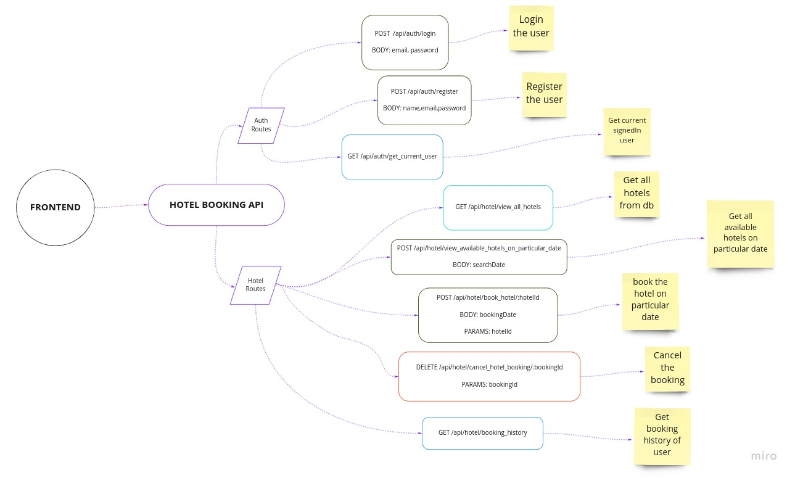
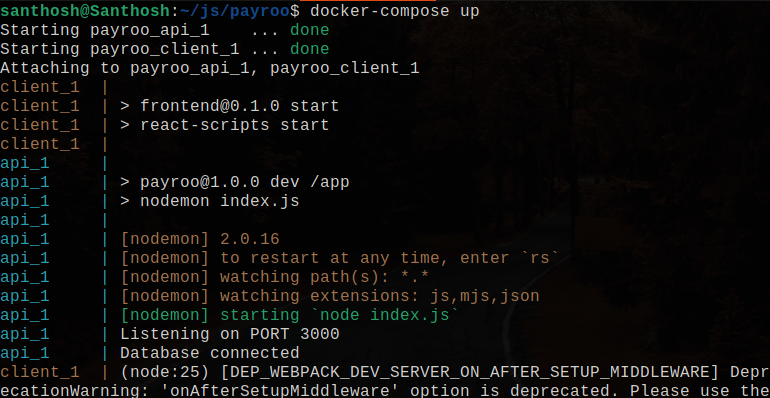
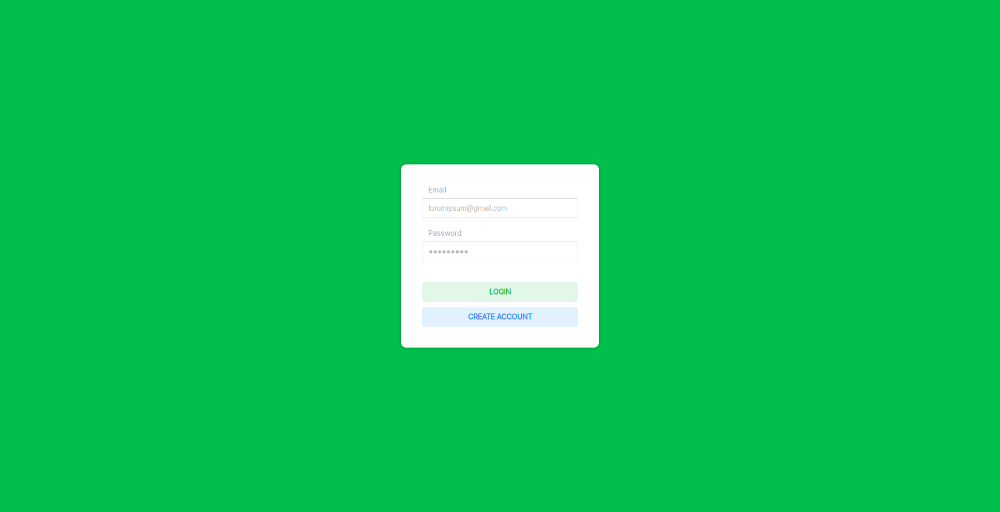
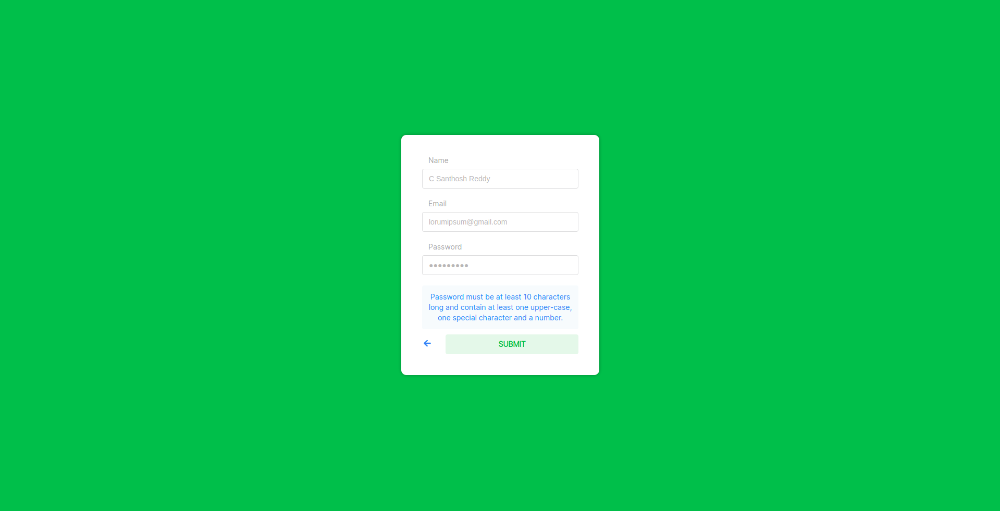
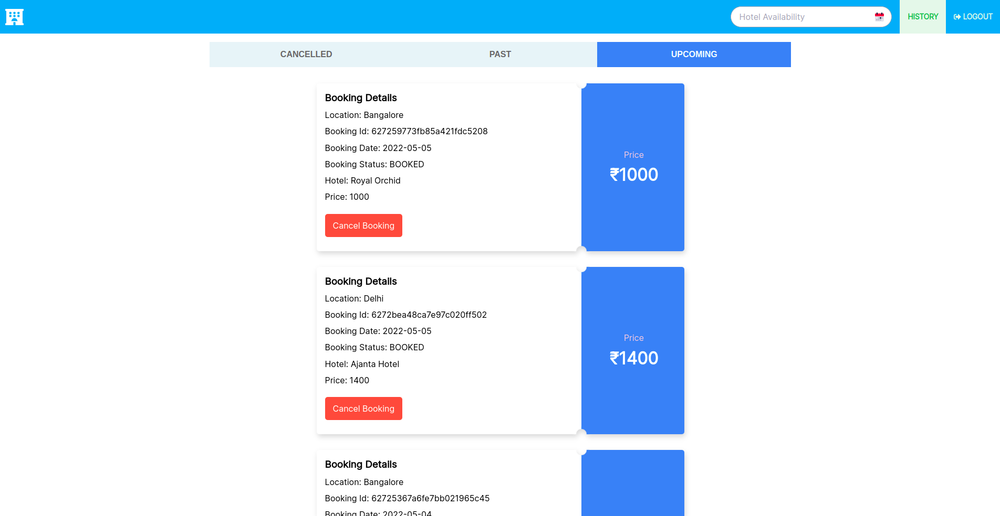
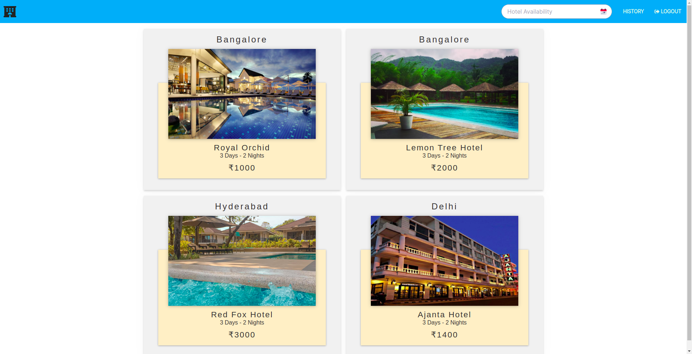
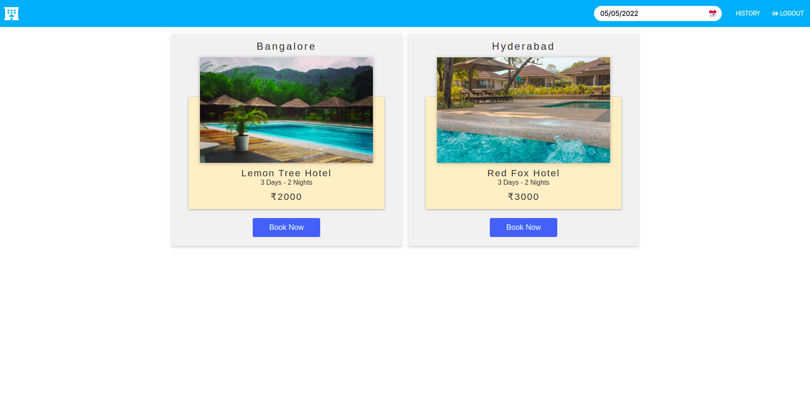
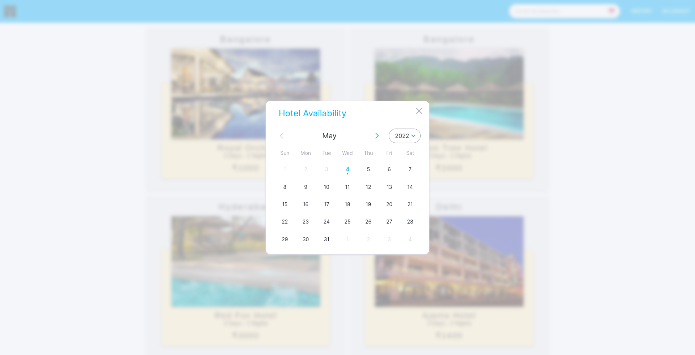
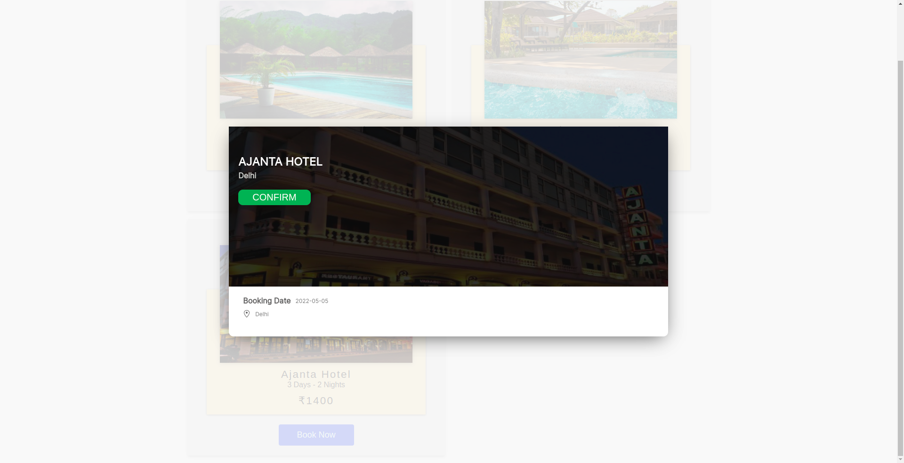

# Hotel Booking application

### Responsive on both mobile and desktop

### [Click Here](https://miro.com/app/board/uXjVO3392R8=/?share_link_id=775498590617) to view the Architecture Diagrams

### Click on below button to view postman collection

[](https://app.getpostman.com/run-collection/14039115-eac187ed-8cc1-42b4-be56-c9686f847075?action=collection%2Ffork&collection-url=entityId%3D14039115-eac187ed-8cc1-42b4-be56-c9686f847075%26entityType%3Dcollection%26workspaceId%3D2728564a-1f94-4887-a838-082acda9f6b0)

### Tech Used

- Docker 🐳 (Containerization)
- Node, Express JS, RESTapi (Backend)
- React 18, Redux ⚛ (Frontend)
- MongoDB (Database)
- Jest (Testing)

---

### Architecture Design



### Explanation

<table>
    <tbody>
    <tr>
      <th>Service</th>
      <th>Tech Used</th>
      <th>Description</th>
    </tr>
    <tr>
      <td>Client</td>
      <td>
        <ul>
          <li>React JS (latest version 18)</li>
          <li>Redux (State managment)</li>
        </ul>
      </td>
      <td>
        <ul>
          <li>This is the front end of the application</li>
          <li>The client container provides an interface to book a hotel for a particular date</li>
        </ul>
      </td>
    </tr>
    <tr>
      <td>Server</td>
      <td>
        <ul>
          <li>Node JS</li>
          <li>Express JS</li>
        </ul>
      </td>
      <td>
        <ul>
          <li>Handles request to <code>/api/auth</code> for Registration and Login of Users</li>
          <li>Handles request to <code>/api/hotel/book_hotel</code> for booking the hotel for a particular date</li>
          <li>Handles request to <code>/api/hotel/view_all_hotels</code> for getting all hotels from db</li>
         <li>Handles request to <code>/api/hotel/view_all_available_hotels</code> for getting all available hotels for given particular date</li>
          <li>Handles request to <code>/api/hotel/booking_history</code> for showing users booking history</li>
        </ul>
      </td>
    </tr>
    <tr>
      <td>Database</td>
      <td>
        <ul>
          <li>Mongo DB</li>
          <li>Mongoose (ODM)</li>
        </ul>
      </td>
      <td>
        <ul>
          <li>Hotel data is pre filled already in mongo atlas</li>
          <li>Hotel Schema contains hotel name, price, image, location</li>
          <li>Used mongoose ODM to connect to mongodb database on cloud</li>
        </ul>
      </td>
    </tr>
  </tbody>
</table>

---

### Requirements to run the application

- Docker 🐳
- Docker Compose

---

### Install, run and test with just one command

Setup to run the application

```
docker-compose up
```



Check out the app on `localhost:3000`

### Screenshots

1. login page
   

2. Register page
   

3. Booking History page
   

4. View all hotels from the prefilled database
   

5. View available hotels on particular page
   

6. Date picker Modal
   

7. Confirmation Modal
   
